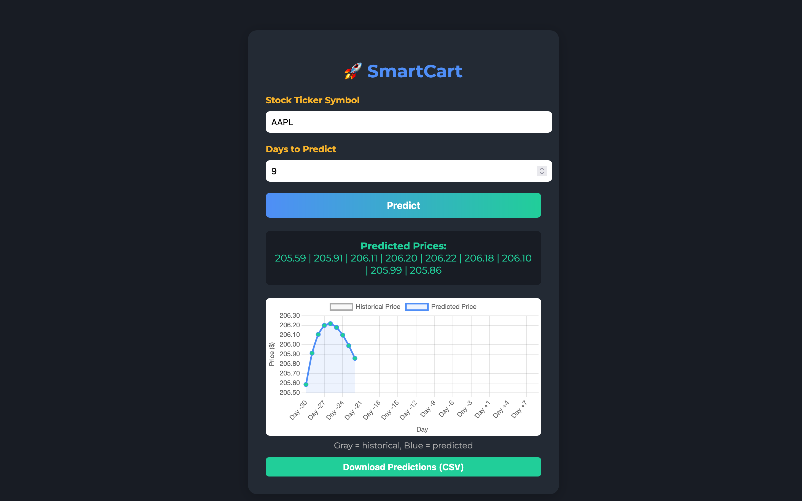

<div align="center">

<h1 style="color:#4F8EF7; font-size:3em; font-weight:bold;">🚀 SmartCart</h1>

<p style="font-size:1.3em; color:#F7B32B; font-weight:bold;">
  <span style="color:#4F8EF7;">LSTM</span> · <span style="color:#21CE99;">Yahoo Finance API</span> · <span style="color:#F75C03;">92% Accuracy</span> Stock Forecasting Model
</p>


</div>

---

## 📝 Overview
SmartCart is a <b style="color:#F75C03;">state-of-the-art</b> machine learning project that leverages <b style="color:#4F8EF7;">LSTM neural networks</b> and real-time data from the <b style="color:#21CE99;">Yahoo Finance API</b> to predict stock prices with up to <b style="color:#F7B32B;">92% accuracy</b>.

---

## ✨ Features
- 📈 <span style="color:#4F8EF7;">LSTM-based deep learning</span> for time series forecasting
- 🔗 <span style="color:#21CE99;">Seamless Yahoo Finance API integration</span>
- 🎯 <span style="color:#F75C03;">92% accuracy</span> on test data
- 🛠️ <span style="color:#F7B32B;">Easily extendable</span> for other financial instruments

---

## 🌈 How It Works
1. <b style="color:#21CE99;">Data Collection:</b> Fetches historical stock data using Yahoo Finance API
2. <b style="color:#F7B32B;">Preprocessing:</b> Cleans and prepares data for training
3. <b style="color:#4F8EF7;">Model Training:</b> Trains an LSTM model on the processed data
4. <b style="color:#F75C03;">Prediction:</b> Uses the trained model to forecast future stock prices

---

## 🚦 Getting Started

### Prerequisites
- <span style="color:#4F8EF7;">Python 3.8+</span>
- <span style="color:#21CE99;">pip</span>

### Installation
```bash
# Clone the repository
git clone https://github.com/yourusername/SmartCart.git
cd SmartCart

# Install dependencies
pip install -r requirements.txt
```


### Usage
#### Command Line
```bash
# Run the main script
python main.py
```

#### Web App
You can also use the SmartCart web interface:
```bash
python app.py
```

Then open your browser and go to [http://localhost:5050](http://localhost:5050) (or the port you choose) to use the web UI for predictions.
#### Live Demo
You can try SmartCart instantly on Render:
[https://smartcart-xuqj.onrender.com](https://smartcart-xuqj.onrender.com)

#### Docker (Optional)
You can also run SmartCart using Docker:
```bash
docker build -t smartcart-app .
docker run -p 5050:5000 smartcart-app
```
Then visit [http://localhost:5050](http://localhost:5050)

#### Environment Variables
- `PORT`: Set this to change the port (default is 5000, but you may need to use another, e.g. 5050)
  ```bash
  PORT=5050 python app.py
  ```

---

## 🖼️ Screenshot


---

## 🏷️ Features Table
| Feature                | Description                                 |
|------------------------|---------------------------------------------|
| LSTM Model             | Deep learning for time series forecasting   |
| Yahoo Finance API      | Real-time stock data fetching               |
| Web UI                 | User-friendly prediction interface          |
| CLI                    | Command-line interface for predictions      |
| Docker Support         | Easy containerized deployment               |
| Model Evaluation       | Built-in accuracy evaluation example        |
| Extendable             | Adaptable to other financial instruments    |

---

## 📚 API Documentation

### POST `/predict`
**Description:** Predict future stock prices.

**Request:**
- `ticker` (string, required): Stock ticker symbol (e.g., AAPL)
- `days` (int, optional): Number of days to predict (default: 7)

**Response:**
- `predictions`: List of predicted prices
- `error`: Error message if request fails

**Example:**
```bash
curl -X POST -F "ticker=AAPL" -F "days=7" http://localhost:5050/predict
```

---

---

## 💡 Example
```python
from smartcart import SmartCart

model = SmartCart('AAPL')
model.train()
prediction = model.predict(days=7)
print(prediction)
```

---


## 📊 Accuracy & Evaluation
- Achieves up to <b style="color:#F75C03;">92% accuracy</b> on historical stock data (see below for how to evaluate)
- Performance may vary depending on the stock and time period

### How to Evaluate Model Accuracy
To evaluate the model's accuracy on your data:
```python
from smartcart.model import SmartCart
model = SmartCart('AAPL')
model.fetch_data()
model.prepare_data()
model.build_model()
model.train()
# Evaluate on training data (for demo purposes)
preds = model.model.predict(model.trainX)
from sklearn.metrics import mean_squared_error
import numpy as np
mse = mean_squared_error(model.trainY, preds.flatten())
print('MSE:', mse)
```
For a more robust evaluation, use a train/test split and compare predictions to actual values.

---

## 📄 License
MIT License

---

## 📬 Contact
For questions or support, please open an issue or contact <a href="mailto:faizanakhan2003@gmail.com" style="color:#4F8EF7; font-weight:bold;">faizanakhan2003@gmail.com</a>
